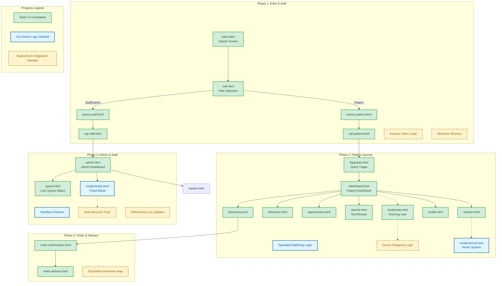

# Clinic Flow: System Architecture & Progress Map

This document serves as the master reference for the Clinic Flow architecture, tracking both implemented UI states and pending logic integrations.

### **1. System Master Map**
The following diagram traces the end-to-end user journey across all roles.

---

### **2. Detailed Progress Audit**

#### **Phase 1: Authentication & Entry**
*   ✅ **Completed:** Full Splash-to-Dashboard flow for Patients, Staff, and Admins. Responsive OTP entry screens.
*   🚧 **Pending:** `localStorage` session handling to skip splash for returning users.

#### **Phase 2: Patient Journey (The "Lazy Thumb" Core)**
*   ✅ **Completed:** Triage questionnaire (`diagnosis.html`), specialist matching logic, and "Test Results" dashboard tile.
*   ✅ **Completed:** "Honor System" arrival check-in and "Running Late" modals.
*   🚧 **Pending:** Dynamic data binding for live queue counts and actual queue swap algorithm.

#### **Phase 3: Pharmacy, Order & Delivery**
*   ✅ **Completed:** Browsing, confirmation, and delivery tracking UI states.
*   🚧 **Pending:** Integration with live mapping APIs for real-time courier movement.

#### **Phase 4: Admin / Operational Control**
*   ✅ **Completed:** Active doctor monitors, triage assignment UI, and overflow standby mode.
*   🚧 **Pending:** WebSockets for live dashboard updates and auto-resume timers for doctor breaks.

---

### **3. Progress Checklist & Logic Status**

| Module | Status | Logic Implemented (Stakeholder Alignment) |
| :--- | :--- | :--- |
| **Splash & Role** | ✅ **Done** | Token check logic (simulated) + Role separation. |
| **Auth (OTP/PIN)** | ✅ **Done** | 2-step phone binding for Patients; Credential binding for Staff. |
| **Triage (Diagnosis)** | ✅ **Done** | **"The System Decisions":** Specialist matching based on symptom selection. |
| **Patient Dashboard** | ✅ **Done** | **"Lazy Thumb":** Replaced redundant Log Out with **Test Results** tile. |
| **Queue Management** | ✅ **Done** | **"Honor System":** Arrival check-in is intentional/user-driven to save dev time. |
| **Admin Controls** | ✅ **Done** | **"Timed Break Mode":** Auto-resumption of queue to prevent human error. |
| **Pharmacy Delivery** | ✅ **Done** | **Contextual UX:** Replaced Queue tab with Pharmacy for post-consultation needs. |

### **4. Key Improvements Applied (V2.2)**
1.  **Redundancy Check:** Consolidated "Log Out" into `profile.html` to prioritize test results on the dashboard.
2.  **Dev Efficiency:** Removed "Flashlight" hardware dependencies; kept the "Call Ambulance" button.
3.  **Battery Optimization:** Switched to "Honor System" modals for check-ins to avoid power-hungry server polling.
4.  **Load Balancing:** Simplified doctor assignment to "Patient Count" rather than "Wait Time" estimation.

### **5. Next Steps for Development**
*   **JavaScript Layer:** Implement session persistence and dynamic ticket updates.
*   **State Management:** Link triage results to dashboard UI.
*   **Live Maps:** Enhance pharmacy delivery with real-time location data.
