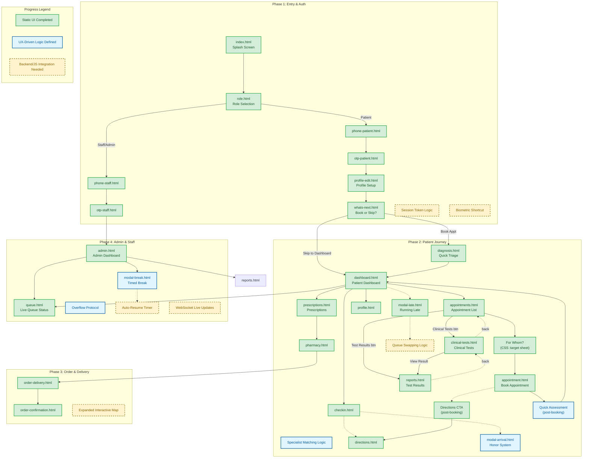

# Clinic Flow: System Architecture & Progress Map

This document serves as the master reference for the Clinic Flow architecture, tracking both implemented UI states and pending logic integrations.

### **1. System Master Map**
The following diagram traces the end-to-end user journey across all roles.

---

### **2. Detailed Progress Audit**

#### **Phase 1: Authentication & Entry**
*   ✅ **Completed:** Full Splash-to-Dashboard flow for Patients, Staff, and Admins. Responsive OTP entry screens.
*   ✅ **Completed (V2.9):** `profile-edit.html` — personal info form (name, DOB→age auto-calc, gender chips, 8-way blood type selector, allergies, emergency contact). "Save & Continue" navigates to `whats-next.html`. Also reachable from `profile.html` Personal Info card for edits.
*   ✅ **Completed (V2.9):** `whats-next.html` — standalone "What's Next?" decision screen at its own URL. Patient chooses **Book an Appointment** (→ `diagnosis.html`) or **Go to Dashboard** (→ `dashboard.html`). Back button returns to `profile-edit.html`.
*   🚧 **Pending:** `localStorage` session handling to skip splash for returning users.

#### **Phase 2: Patient Journey (The "Lazy Thumb" Core)**
*   ✅ **Completed:** Triage questionnaire (`diagnosis.html`), specialist matching logic, and "Test Results" dashboard tile.
*   ✅ **Completed:** "Honor System" arrival check-in and "Running Late" modals.
*   ✅ **Completed (V2.3):** `clinical-tests.html` — doctor-ordered test pipeline tracker (Ordered → Sample → Processing → Ready). Covers lab, imaging, and cardiac test categories. Includes preparation instructions, clinic location chips, and a "View Result" CTA that links to `reports.html`.
*   ✅ **Completed (V2.3):** Dashboard tile restructured — Directions replaced by Clinical Tests. Dashboard now maps to the full patient lifecycle: Check In → Appointments → Clinical Tests → Test Results.
*   ✅ **Completed (V2.3):** `reports.html` updated with a "Pending Clinical Tests" shortcut banner linking to `clinical-tests.html`.
*   � **Logic Defined (V2.5):** Post-booking Quick Assessment modal — captures symptom changes or prep notes immediately after an appointment is confirmed, then returns to the dashboard.
*   �🚧 **Pending:** Dynamic data binding for live queue counts and actual queue swap algorithm.

#### **Phase 3: Pharmacy, Order & Delivery**
*   ✅ **Completed:** Browsing, confirmation, and delivery tracking UI states.
*   🚧 **Pending:** Integration with live mapping APIs for real-time courier movement.

#### **Phase 4: Admin / Operational Control**
*   ✅ **Completed:** Active doctor monitors, triage assignment UI, and overflow standby mode.
*   🚧 **Pending:** WebSockets for live dashboard updates and auto-resume timers for doctor breaks.

---

### **3. Progress Checklist & Logic Status**

| Module | Status | Logic Implemented (Stakeholder Alignment) |
| :--- | :--- | :--- |
| **Splash & Role** | ✅ **Done** | Token check logic (simulated) + Role separation. |
| **Auth (OTP/PIN)** | ✅ **Done** | 2-step phone binding for Patients; Credential binding for Staff. |
| **Profile Setup** | ✅ **Done (V2.9)** | **"First Run":** `profile-edit.html` inserted after patient OTP. Collects name, DOB (age auto-calcs), gender, blood type, allergies, emergency contact. Saves → `whats-next.html`. Reachable from `profile.html` Personal Info card for edits. |
| **What's Next Decision** | ✅ **Done (V2.9)** | **"Right Moment":** `whats-next.html` is its own page. Patient picks: Book Appointment → `diagnosis.html`, or Go to Dashboard → `dashboard.html`. Back → `profile-edit.html`. |
| **Triage (Diagnosis)** | ✅ **Done** | **"The System Decisions":** Specialist matching based on symptom selection. |
| **Patient Dashboard** | ✅ **Done (V2.7)** | **"Lazy Thumb":** Tiles restructured — Check In · Book Appt (→ For Whom sheet) · Prescriptions · My Queue. Clinical Tests & Test Results retired as standalone tiles; now appointment-scoped. |
| **Contextual Directions** | ✅ **Done (V2.4)** | **"Right Place":** Directions CTA added to `appointment.html` footer so wayfinding appears at the moment of booking, not on the dashboard. |
| **Appointments List** | ✅ **Done (V2.6)** | **"Right Start":** `appointments.html` shows full history. "New Appointment" CTA triggers For Whom sheet before routing to booking form. |
| **Prescriptions Nav** | ✅ **Done (V2.8)** | **"Lazy Thumb":** Pharmacy replaced in bottom nav by Rx. Tap a prescription → pharmacy.html pre-loaded. Multi-select: tick multiple active Rx cards and fill in one pharmacy run. "Select All" / "Deselect All" toggle in header. OTC access via "Browse All" footer CTA. |
| **Post-Booking Assessment** | 🔷 **Logic Defined (V2.5)** | **"Close the Loop":** Quick Assessment step inserted after appointment confirmation — captures any updated symptoms or prep requirements before returning patient to dashboard. |
| **Clinical Tests** | ✅ **Done (V2.7)** | **"Zero Input":** All test data (doctor, location, prep) pre-filled. 4-step visual pipeline. Back nav → Appointments. Context header shows parent appointment. |
| **Queue Management** | ✅ **Done** | **"Honor System":** Arrival check-in is intentional/user-driven to save dev time. |
| **Admin Controls** | ✅ **Done** | **"Timed Break Mode":** Auto-resumption of queue to prevent human error. |
| **Pharmacy Delivery** | ✅ **Done** | **Contextual UX:** Replaced Queue tab with Pharmacy for post-consultation needs. |

### **4. Key Improvements Applied (V2.2)**
1.  **Redundancy Check:** Consolidated "Log Out" into `profile.html` to prioritize test results on the dashboard.
2.  **Dev Efficiency:** Removed "Flashlight" hardware dependencies; kept the "Call Ambulance" button.
3.  **Battery Optimization:** Switched to "Honor System" modals for check-ins to avoid power-hungry server polling.
4.  **Load Balancing:** Simplified doctor assignment to "Patient Count" rather than "Wait Time" estimation.

### **Key Improvements Applied (V2.3)**
5.  **Post-Consultation Gap Closed:** Added `clinical-tests.html` to track the full test lifecycle (ordered → sample → processing → ready). Previously, patients had no visibility into tests ordered but not yet resulted.
6.  **Dashboard Lifecycle Alignment:** Replaced the low-frequency "Directions" dashboard tile with "Clinical Tests". The four tiles now directly map to the four main post-triage actions: **Check In → Appointments → Clinical Tests → Test Results**.
7.  **Cross-Screen Linking:** `reports.html` now surfaces a "Pending Clinical Tests" banner, and `clinical-tests.html` surfaces a "View Result" CTA — patients can navigate between ordered tests and completed results without returning to the dashboard.
8.  **Zero-Input Compliance:** The Clinical Tests page shows all data (doctor, date, location, prep requirement) pre-populated, requiring no typing from the patient consistent with the "Lazy Thumb" rule.

### **Key Improvements Applied (V2.4)**
9.  **Contextual Directions Access (V2.4):** Directions removed from dashboard (wrong frequency) but re-surfaced contextually in `appointment.html` footer. The user sees a "Get Directions to Clinic" CTA immediately after confirming or saving a booking — the only moment they genuinely need wayfinding. Check-In retains its own directions link for day-of use. Right feature, right place.

### **Key Improvements Applied (V2.7)**
13. **Appointment-Contextual Navigation Chain (V2.7):** Clinical Tests and Test Results are no longer reachable as standalone dashboard tiles. Access is now always appointment-scoped: each appointment card in `appointments.html` exposes inline action buttons — orange "Clinical Tests" (→ `clinical-tests.html`) and/or green "Test Results" (→ `reports.html`) — shown only when contextually relevant (suppressed on cancelled appointments). Back navigation throughout the chain returns to the parent screen (`reports.html` ← `clinical-tests.html` ← `appointments.html`). Context headers in both screens display the originating appointment (doctor + date).

14. **Dashboard Tile Restructure (V2.7):** Four quick-action tiles realigned. "Clinical Tests" → **Prescriptions** (`prescriptions.html`). "Test Results" → **My Queue** (`queue.html`). "Appointments" → **"Book Appt"** (links directly to `appointments.html#for-whom`, skipping the history list). New tile map: Check In · Book Appt · Prescriptions · My Queue.

15. **Direct-to-Sheet Booking Shortcut (V2.7):** Dashboard "Book Appt" tile bypasses the appointment history list and opens the "Who is this for?" bottom-sheet directly, removing one tap from the booking creation flow. Appointment history remains accessible via the bottom nav Appts tab.

### **Key Improvements Applied (V2.6)**
11. **Appointments List + For Whom (V2.6):** New `appointments.html` serves as the Appointments entry point — shows history (Upcoming / Past / Cancelled) and a "New Appointment" CTA that triggers a CSS `:target` bottom-sheet asking who the appointment is for before routing to the booking form. `appointment.html` back nav now returns to `appointments.html`.
12. **Prescriptions Replace Pharmacy in Nav (V2.6):** Bottom nav tab changed from Pharmacy → Rx (`prescriptions.html`). Pharmacy is now a fulfilment destination reached contextually from a prescription card (tap → `pharmacy.html`). A "Browse All Pharmacies" footer CTA preserves OTC access.

### **Key Improvements Applied (V2.5)**
10. **Post-Booking Quick Assessment (V2.5):** A lightweight assessment step is inserted immediately after an appointment is created. This captures any symptom updates or preparation requirements while the context is fresh, then returns the patient to the dashboard. Flow: `appointment.html` → Quick Assessment → `dashboard.html`. Prevents the gap where a patient books an appointment but no updated clinical context is recorded until the visit day.

### **Key Improvements Applied (V2.8)**
16. **Multi-Select Prescription Fill (V2.8):** Active prescription cards in `prescriptions.html` are now individually selectable (tap to tick). A circular checkbox on each card fills blue on selection; the card border highlights. When ≥1 card is selected, a dark bulk action bar slides in above the footer showing "Ready to fill — X Prescriptions" with a single "Fill at Pharmacy →" CTA, routing the whole batch to `pharmacy.html` in one trip. A "Select All / Deselect All" toggle in the header header handles the common case of filling all active prescriptions at once. Individual "Fill at Pharmacy →" inline CTAs remain on each card as a single-item fast path (tap stops propagation so it bypasses the selection toggle). Filled and expired cards are not selectable.

### **Key Improvements Applied (V2.9)**
17. **Profile Setup on First Login (V2.9):** Two dedicated pages replace the old in-page toggle. `profile-edit.html` collects personal details (name, DOB with auto-age-calc, gender chips, 8-way blood type selector, allergies, emergency contact) — reachable from `profile.html` → Personal Info for subsequent edits. `whats-next.html` is a separate page (own URL) that presents two clear paths: **Book an Appointment** (→ `diagnosis.html`) or **Go to Dashboard** (→ `dashboard.html`). Splitting the screens gives each a clean back-navigation target and a bookmarkable URL, while still adhering to "Lazy Thumb" — no data already linked to the phone number is re-asked.

### **5. Next Steps for Development**
*   **JavaScript Layer:** Implement session persistence and dynamic ticket updates.
*   **State Management:** Link triage results to dashboard UI; bind clinical test orders from doctor's consultation to patient view.
*   **Live Maps:** Enhance pharmacy delivery with real-time location data.
*   **Push Notifications:** Notify patient when a test result changes status to "Ready".
