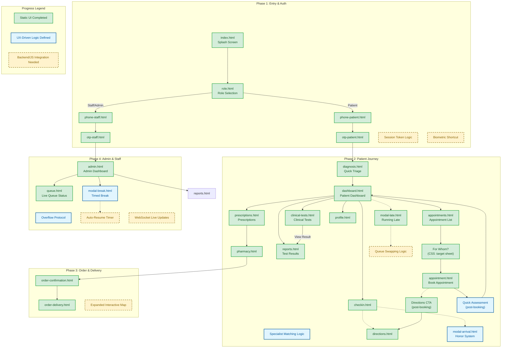

# Clinic Flow: System Architecture & Progress Map

This document serves as the master reference for the Clinic Flow architecture, tracking both implemented UI states and pending logic integrations.

### **1. System Master Map**
The following diagram traces the end-to-end user journey across all roles.

---

### **2. Detailed Progress Audit**

#### **Phase 1: Authentication & Entry**
*   ✅ **Completed:** Full Splash-to-Dashboard flow for Patients, Staff, and Admins. Responsive OTP entry screens.
*   🚧 **Pending:** `localStorage` session handling to skip splash for returning users.

#### **Phase 2: Patient Journey (The "Lazy Thumb" Core)**
*   ✅ **Completed:** Triage questionnaire (`diagnosis.html`), specialist matching logic, and "Test Results" dashboard tile.
*   ✅ **Completed:** "Honor System" arrival check-in and "Running Late" modals.
*   ✅ **Completed (V2.3):** `clinical-tests.html` — doctor-ordered test pipeline tracker (Ordered → Sample → Processing → Ready). Covers lab, imaging, and cardiac test categories. Includes preparation instructions, clinic location chips, and a "View Result" CTA that links to `reports.html`.
*   ✅ **Completed (V2.3):** Dashboard tile restructured — Directions replaced by Clinical Tests. Dashboard now maps to the full patient lifecycle: Check In → Appointments → Clinical Tests → Test Results.
*   ✅ **Completed (V2.3):** `reports.html` updated with a "Pending Clinical Tests" shortcut banner linking to `clinical-tests.html`.
*   � **Logic Defined (V2.5):** Post-booking Quick Assessment modal — captures symptom changes or prep notes immediately after an appointment is confirmed, then returns to the dashboard.
*   �🚧 **Pending:** Dynamic data binding for live queue counts and actual queue swap algorithm.

#### **Phase 3: Pharmacy, Order & Delivery**
*   ✅ **Completed:** Browsing, confirmation, and delivery tracking UI states.
*   🚧 **Pending:** Integration with live mapping APIs for real-time courier movement.

#### **Phase 4: Admin / Operational Control**
*   ✅ **Completed:** Active doctor monitors, triage assignment UI, and overflow standby mode.
*   🚧 **Pending:** WebSockets for live dashboard updates and auto-resume timers for doctor breaks.

---

### **3. Progress Checklist & Logic Status**

| Module | Status | Logic Implemented (Stakeholder Alignment) |
| :--- | :--- | :--- |
| **Splash & Role** | ✅ **Done** | Token check logic (simulated) + Role separation. |
| **Auth (OTP/PIN)** | ✅ **Done** | 2-step phone binding for Patients; Credential binding for Staff. |
| **Triage (Diagnosis)** | ✅ **Done** | **"The System Decisions":** Specialist matching based on symptom selection. |
| **Patient Dashboard** | ✅ **Done** | **"Lazy Thumb":** Directions tile replaced by Clinical Tests — maps full patient lifecycle. |
| **Contextual Directions** | ✅ **Done (V2.4)** | **"Right Place":** Directions CTA added to `appointment.html` footer so wayfinding appears at the moment of booking, not on the dashboard. |
| **Appointments List** | ✅ **Done (V2.6)** | **"Right Start":** `appointments.html` shows full history. "New Appointment" CTA triggers For Whom sheet before routing to booking form. |
| **Prescriptions Nav** | ✅ **Done (V2.6)** | **"Lazy Thumb":** Pharmacy replaced in bottom nav by Rx. Tap a prescription → pharmacy.html pre-loaded. OTC access via "Browse All" footer CTA. |
| **Post-Booking Assessment** | 🔷 **Logic Defined (V2.5)** | **"Close the Loop":** Quick Assessment step inserted after appointment confirmation — captures any updated symptoms or prep requirements before returning patient to dashboard. |
| **Clinical Tests** | ✅ **Done** | **"Zero Input":** All test data (doctor, location, prep) pre-filled. 4-step visual pipeline. Cross-links to Test Results. |
| **Queue Management** | ✅ **Done** | **"Honor System":** Arrival check-in is intentional/user-driven to save dev time. |
| **Admin Controls** | ✅ **Done** | **"Timed Break Mode":** Auto-resumption of queue to prevent human error. |
| **Pharmacy Delivery** | ✅ **Done** | **Contextual UX:** Replaced Queue tab with Pharmacy for post-consultation needs. |

### **4. Key Improvements Applied (V2.2)**
1.  **Redundancy Check:** Consolidated "Log Out" into `profile.html` to prioritize test results on the dashboard.
2.  **Dev Efficiency:** Removed "Flashlight" hardware dependencies; kept the "Call Ambulance" button.
3.  **Battery Optimization:** Switched to "Honor System" modals for check-ins to avoid power-hungry server polling.
4.  **Load Balancing:** Simplified doctor assignment to "Patient Count" rather than "Wait Time" estimation.

### **Key Improvements Applied (V2.3)**
5.  **Post-Consultation Gap Closed:** Added `clinical-tests.html` to track the full test lifecycle (ordered → sample → processing → ready). Previously, patients had no visibility into tests ordered but not yet resulted.
6.  **Dashboard Lifecycle Alignment:** Replaced the low-frequency "Directions" dashboard tile with "Clinical Tests". The four tiles now directly map to the four main post-triage actions: **Check In → Appointments → Clinical Tests → Test Results**.
7.  **Cross-Screen Linking:** `reports.html` now surfaces a "Pending Clinical Tests" banner, and `clinical-tests.html` surfaces a "View Result" CTA — patients can navigate between ordered tests and completed results without returning to the dashboard.
8.  **Zero-Input Compliance:** The Clinical Tests page shows all data (doctor, date, location, prep requirement) pre-populated, requiring no typing from the patient consistent with the "Lazy Thumb" rule.

### **Key Improvements Applied (V2.4)**
9.  **Contextual Directions Access (V2.4):** Directions removed from dashboard (wrong frequency) but re-surfaced contextually in `appointment.html` footer. The user sees a "Get Directions to Clinic" CTA immediately after confirming or saving a booking — the only moment they genuinely need wayfinding. Check-In retains its own directions link for day-of use. Right feature, right place.

### **Key Improvements Applied (V2.6)**
11. **Appointments List + For Whom (V2.6):** New `appointments.html` serves as the Appointments entry point — shows history (Upcoming / Past / Cancelled) and a "New Appointment" CTA that triggers a CSS `:target` bottom-sheet asking who the appointment is for before routing to the booking form. `appointment.html` back nav now returns to `appointments.html`.
12. **Prescriptions Replace Pharmacy in Nav (V2.6):** Bottom nav tab changed from Pharmacy → Rx (`prescriptions.html`). Pharmacy is now a fulfilment destination reached contextually from a prescription card (tap → `pharmacy.html`). A "Browse All Pharmacies" footer CTA preserves OTC access.

### **Key Improvements Applied (V2.5)**
10. **Post-Booking Quick Assessment (V2.5):** A lightweight assessment step is inserted immediately after an appointment is created. This captures any symptom updates or preparation requirements while the context is fresh, then returns the patient to the dashboard. Flow: `appointment.html` → Quick Assessment → `dashboard.html`. Prevents the gap where a patient books an appointment but no updated clinical context is recorded until the visit day.

### **5. Next Steps for Development**
*   **JavaScript Layer:** Implement session persistence and dynamic ticket updates.
*   **State Management:** Link triage results to dashboard UI; bind clinical test orders from doctor's consultation to patient view.
*   **Live Maps:** Enhance pharmacy delivery with real-time location data.
*   **Push Notifications:** Notify patient when a test result changes status to "Ready".
